<div align="center">
<br>
  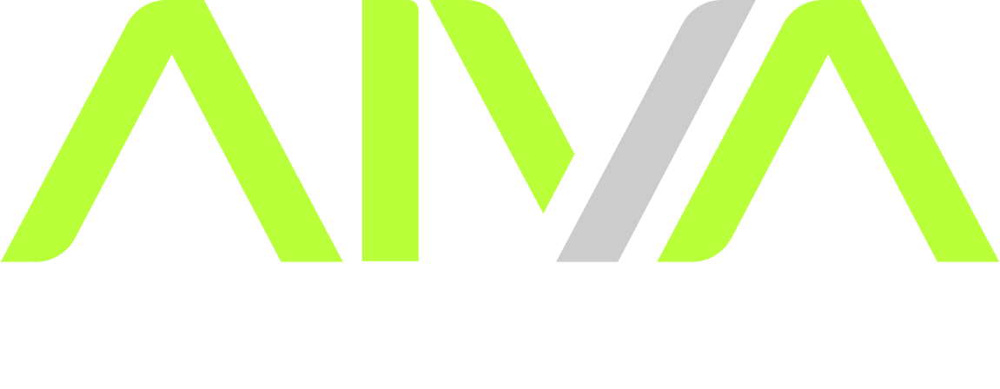
<br>
</div>

<p>
 <a href="#-sobre-o-projeto">Sobre</a>
</p>
<p>
 <a href="#-funcionalidades">Funcionalidades</a>
</p>
<p>
 <a href="#-layout">Layout</a>
</p>
<p>
 <a href="#-como-executar-o-projeto">Como executar</a>
</p>
<p>
 <a href="#-tecnologias">Tecnologias</a>
</p>
<p>
 <a href="#-contribuidores">Contribuidores</a>
</p>
<p>
 <a href="#-autor">Autor</a>
</p>

## 💻 Sobre o projeto

AIVA WEB

O <b>AIVA WEB</b> tem como principal objetivo <i>"gerenciar usuários e feedbacks de usuários selecionados"</i> com ele é possivel listar os usuários cadastrados, visualizar feedbacks, e até mesmo gerar um link para a coleta individual do feedback, agregando com um design super moderno de forma simples e objetiva. Pensado e construído com intuito de agregação de estudos de tecnologia.</p>

Para o desenvolvimento desta solução foi apostado no NextJS como tecnologia principal frontend, devido a alguns aspectos como:
- File-Based Routing: Seu roteamento é todo baseado em pastas, no qual permitiu rapidez na construção pensando que não tive o trabalho de criar toda a parte de roteamento.
- Performance Optimization: Possuí otimização de imagens no qual todas as imagens são redimensionadas no servidor da Vercel, trazendo uma boa performance para a aplicação.
- Hybrid Rendering (SSR, SSG, ISR): Sua renderização hibrida nos permitiu criar paginas lado do servidor ganhando em extrema performance.
- Vercel Integration: Possuí integração direta com a Vercel, no qual facilitou bastante a parte de deploy pois a configuração é bem mais simples que qualquer outro serviço devido o NextJs pertencer a Vercel.
- Native support: O NextJs possuí suporte nativo a diversas tecnologias como Eslint, Typescript, Prettier entre outras que teve um extremo ganho na parte de configurações prontas.
- Enterprise Adoption: É utilizado por grandes empresas como Netflix, TikTok, Notion. Trazendo uma grande segurança.
---

## ⚙️ Funcionalidades

- [x] Login:
  - [x] Pagina responsável por realizar a autenticação do usuário.

- [x] Home:
  - [x] Pagina "mostruario" com o principal objetivo de visualizar estatísticas principais do app, como a "Quantidade de feedbacks" coletados.

- [x] Users:
  - [x] Pagina responsável por listar, cadastrar, editar e excluir usuarios do sistema.
  - [x] Responsável também por criar links de coleta de feedbacks para envio para usuários selecionados.

- [x] Feedbacks:
  - [x] Pagina responsável por visualizar todos os feedbacks coletados pelos usuários (somente visual).
     
- [x] Reports:
  - [x] Pagina responsável por realizar a coleta de feedbacks dos usuários.

---

## 🎨 Layout

### Web

<p align="center" style="display: flex; align-items: flex-start; justify-content: center;">
  
  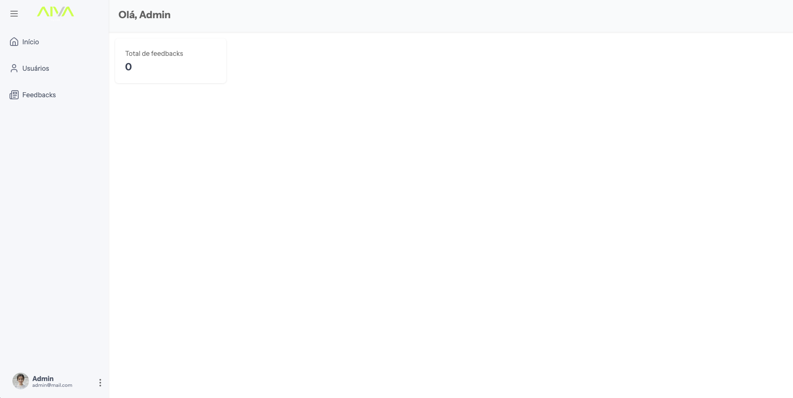
  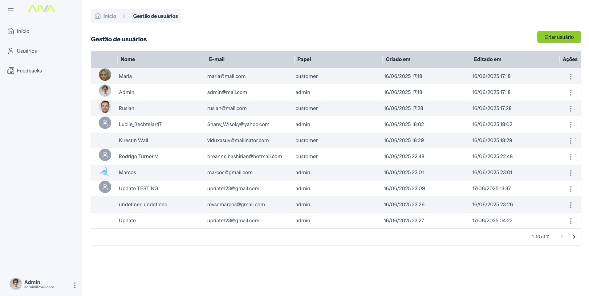
  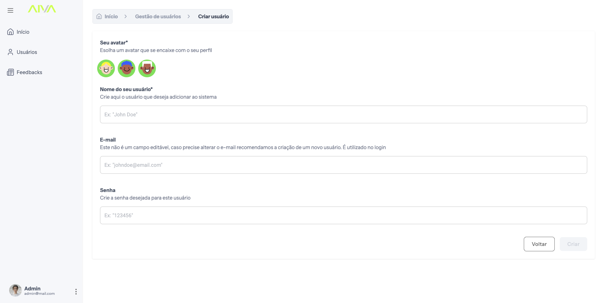
  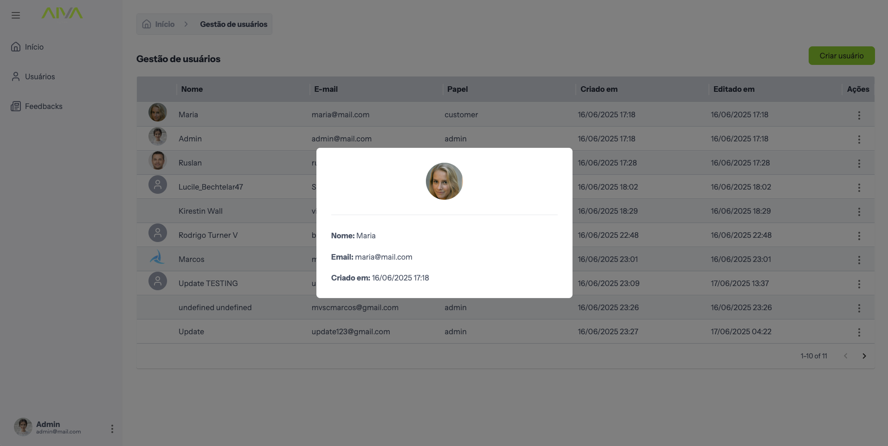
  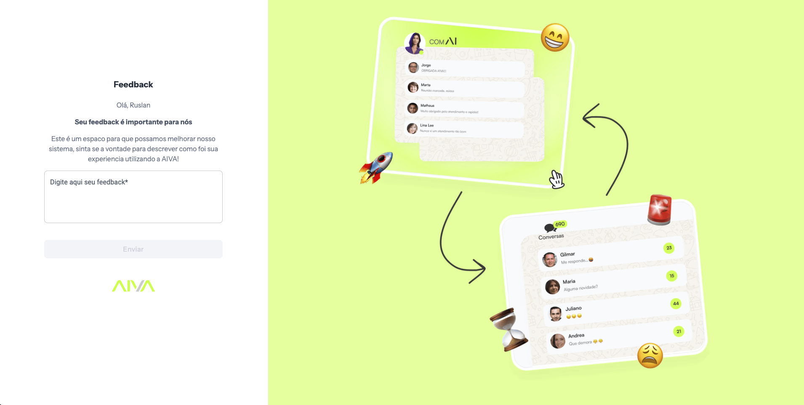
  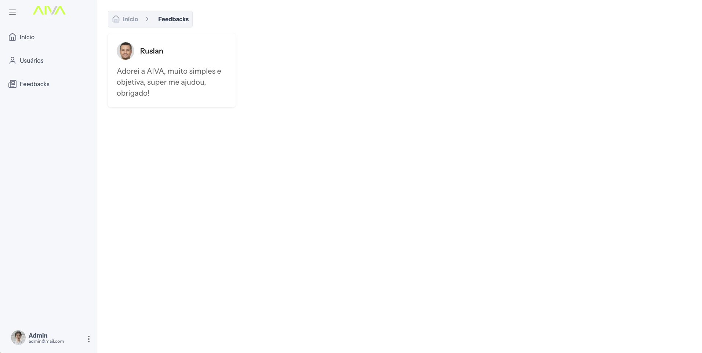
</p>

### Mobile

<p align="center" style="display: flex; align-items: flex-start; justify-content: center;">
  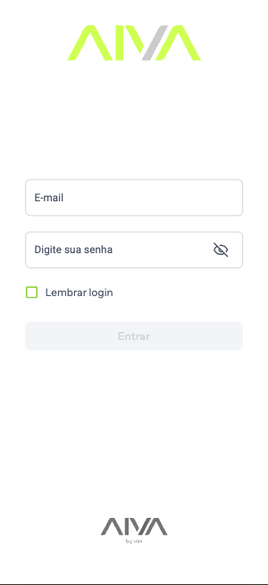
  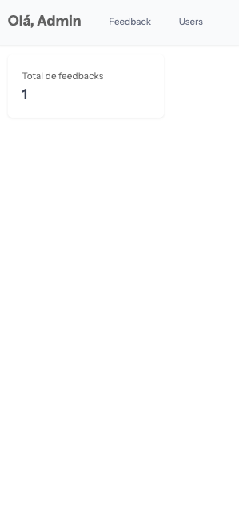
  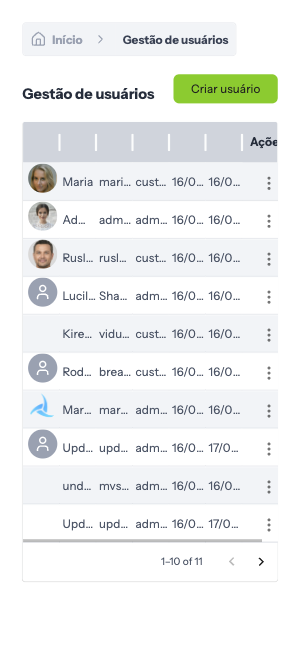
  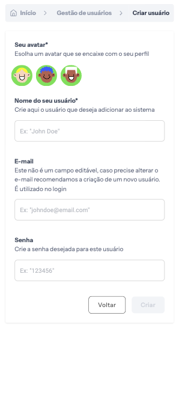
  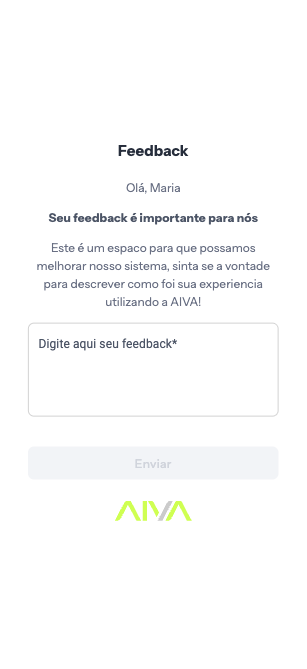
  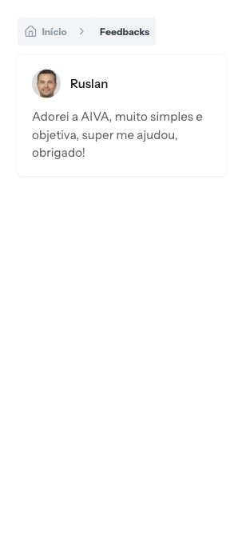
</p>

---

## 🚀 Como executar o projeto

Antes de começar, você vai precisar ter instalado em sua máquina algumas ferramentas, como:
[NodeJS](https://nodejs.org/en/). Para ajudar, recomendo um bom editor para trabalhar com o código como [VSCode](https://code.visualstudio.com/). Deixarei também a documentação anexada do NextJS, principal framework 
utilizado no projeto caso precise de alguma configuração específica

#### 🎲 Adquira o repositorio do projeto

```bash

# Clone este repositório
$ git clone https://github.com/hyankelwin/aiva-web.git


```

#### 🎲 Configurando

```bash

# Abra o projeto em um editor ou cmd na pasta aiva-web
$ cd aiva-web

# Instale as dependências do projeto
$ yarn
ou
$ npm install

💡 Certifique-se de estar na raiz do projeto (pasta aiva-web) para executar
o comando npm install ou yarn

# Variáveis
Uzilizamos variáveis de ambiente para rodar o projeto.

Crie um arquivo na rain do projeto:

$ .env

Agora adiconar a seguinte variável dentro dele:

$ NEXT_PUBLIC_ESCUELAJS_API_URL=https://api.escuelajs.co/api/v1/

```

#### 🎲 Executando a aplicação

```bash

# Rode o seguinte comando no terminal
$ yarn dev
ou
$ npm run dev

```

<p>✅ Pronto, o app estará rodando no host: (http://localhost:3000/)</p>

---

## 🚀 Como executar os testes

Para os testes utilizamos o <b>Jest</b> e para roda-lo é bem simples:

#### 🎲 Executando os testes

```bash

# Rode o seguinte comando no terminal
$ yarn test
ou
$ npm test


```

#### 🎲 Executando os testes com coverage

```bash

# Rode o seguinte comando no terminal
$ yarn test:coverage
ou
$ npm test:coverage

```

---

## :cloud: Disponível na web

O AIVA Web também disponivel na web, para encontra-lo basta acessar o seguinte
endereço na web:

[Site AIVA Web](https://aiva-web-five.vercel.app/)

---

## :chart_with_upwards_trend: Qualidade


### Cypress
O AIVA Web também possuí uma integração com o cypress, afim de garantir uma qualidade no artefato desenvolvido utilizando de testes E2E para analisar todo o fluxo desenvolvido:

```bash

# Rode o seguinte comando no terminal para testar
$ yarn cypress:run
ou
$ npm cypress:run

```

<p align="center" style="display: flex; align-items: flex-start; justify-content: center;">
  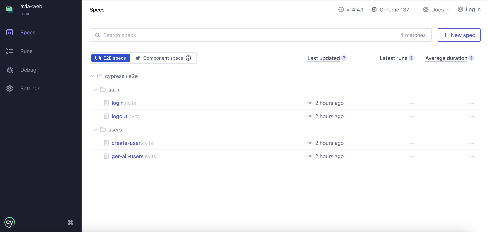
</p>


### Tests (Jest)
Foi contruído uma etapa de teste unitários para assegurar a qualidade em cada unidade de componentes desenvolvido, foi utilizado o Jest para construção adquirindo uma cobertura de **100%** em todos os componentes:

```bash

# Rode o seguinte comando no terminal para testar
$ yarn test
ou
$ npm test

```

<p align="center" style="display: flex; align-items: flex-start; justify-content: center;">
  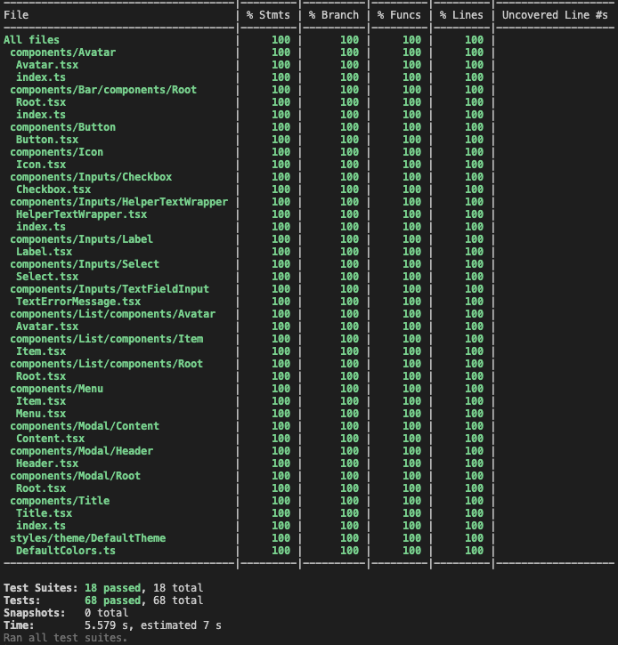
</p>

### Github Actions (CI)
A parte de CI foi construída utilizando o Github Actions (CI/CD), no qual permitiu automatizar fluxos de trabalho de desenvolvimento como (lint, instalação de dependências, testes):

<p align="center" style="display: flex; align-items: flex-start; justify-content: center;">
  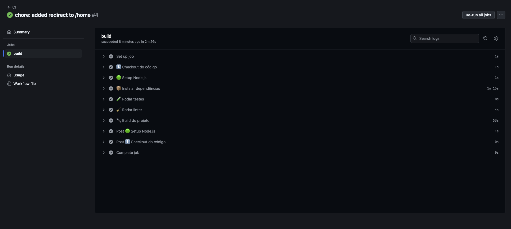
</p>

### Deploy (Vercel)
Para deploy o AIVA Web foi utilizado a vercel devido a agilidade pois é uma ferramenta totalmente integrada e configurada com NextJS, possuí integração com Github no qual a cada push realizado na branch main o deploy 
é realizado automaticamente pela Vercel, e também por ser uma ferramenta gratuíta e segura.

<p align="center" style="display: flex; align-items: flex-start; justify-content: center;">
  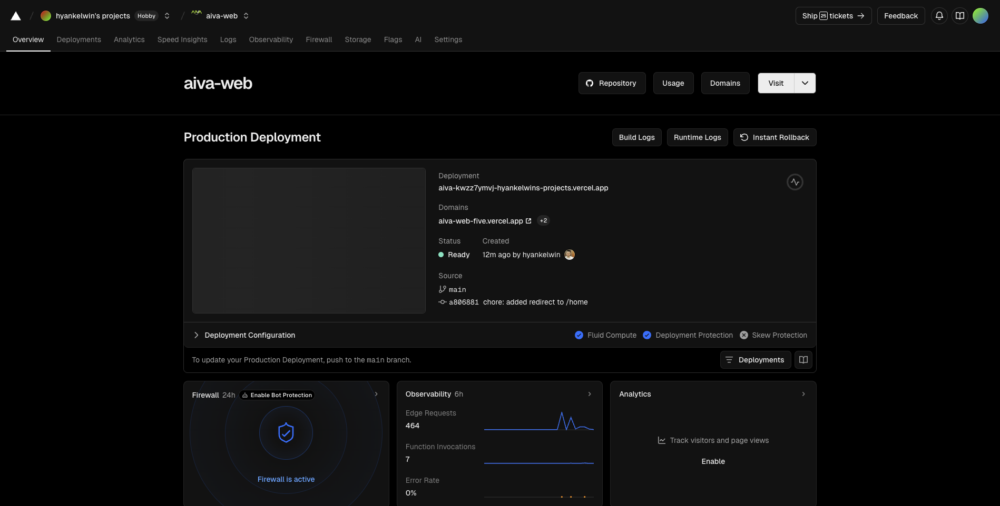
</p>

---

## 🛠 Tecnologias

As seguintes ferramentas foram usadas na construção do projeto:

#### **AIVA Web** ([NextJS](https://nextjs.org/) + [TypeScript](https://www.typescriptlang.org/))

- **[Jest](https://jestjs.io/)**
- **[Eslint](https://eslint.org/)**
- **[Prettier](https://prettier.io/)**
- **[GitHub Actions](https://docs.github.com/pt/actions)**
- **[Vercel](https://vercel.com/)**
- **[Commitlint](https://commitlint.js.org/#/)**
- **[Material Design](https://mui.com/)**
- **[Husky Lint](https://typicode.github.io/husky/#/)**
- **[Cypress](https://www.cypress.io/)**
- **[Zustand](https://zustand-demo.pmnd.rs/)**
- **[Storybook](https://storybook.js.org/)**

> Veja o arquivo [package.json](https://github.com/hyankelwin/aiva-web/blob/main/package.json)

## 👨‍💻 Contribuidores

<table>
  <tr>
    <td align="center"><a href="https://github.com/hyankelwin"><br /><sub><b>Hyan Kelwin</b></sub></a><br /><a href="https://github.com/hyankelwin" >👨‍🚀</a></td>
  </tr>
</table>

## 💪 Como contribuir para o projeto

1. Faça um **fork** do projeto.
2. Crie uma nova branch com as suas alterações: `git checkout -b my-feature`
3. Salve as alterações e crie uma mensagem de commit contando o que você fez: `git commit -m "feature: My new feature"`
4. Envie as suas alterações: `git push origin my-feature`
   > Caso tenha alguma dúvida confira este [guia de como contribuir no GitHub](https://www.linkedin.com/pulse/como-contribuir-em-um-projeto-open-source-github-f%C3%A1bio-amaral/?originalSubdomain=pt)

---

## 🦸 Autor

Desenvolvedor apaixonado por programação e tecnologias.

<a href="https://github.com/hyankelwin">
 
 <br />
 <sub><b>Hyan Kelwin</b></sub></a> <a href="https://github.com/hyankelwin" title="GitHub Hyan">🚀</a>
 <br />

---
